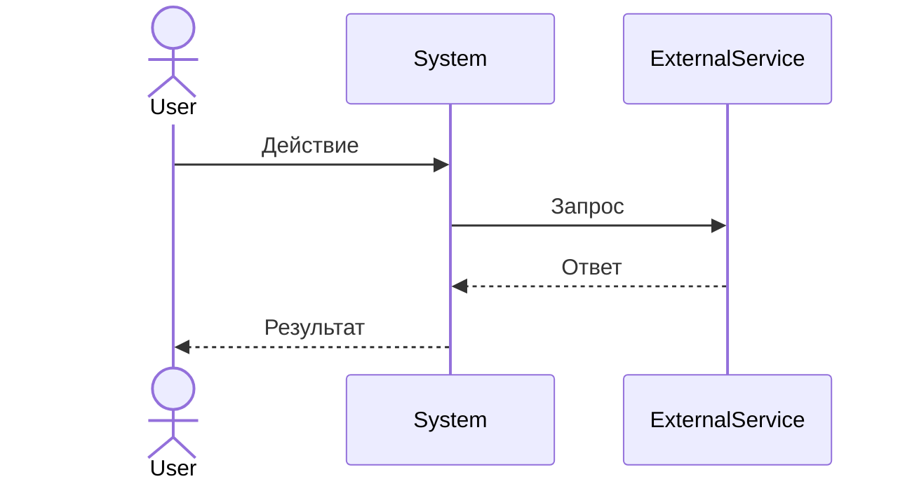
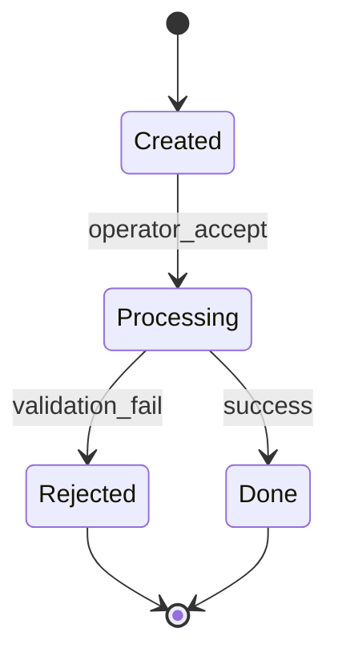

# Skill: Business Process (FSM)

Apply when: task to describe a business process, workflow, or pipeline.

## Principle: each process = Finite State Machine

Structure of each file in `docs/02_Workflow/`:

```
1. Process name
2. Actors (who participates)
3. Trigger (what starts the process)
4. States and transitions
5. Error handlers / rollback
6. Mermaid diagram
```

## Transition format

```
[Current state] → [Trigger] → [New state]
```

Example:
```
[Заявка создана] → [Оператор принял] → [В обработке]
[В обработке] → [Данные невалидны] → [Отклонена] + уведомление
[В обработке] → [Успех] → [Завершена]
```

## Required for each state

- What happens in this state
- Responsible actor
- Possible exits (transitions)
- **Error handler**: what to do if something goes wrong

## Mermaid diagram (mandatory)



Or stateDiagram-v2 for FSM:



## One-file rule

One file = one isolated process. If a process depends on another — link via `[[Process name]]`, do not copy.

After creating a file — update `docs/02_Workflow/_index.md`.

## Related skills

- `pm/brd` — consumer: functional requirements and user stories rely on the processes described here.
- `architect/api-design` — FSM transitions often become endpoints/commands; sequence diagram helps design the contract.
- `laravel-architecture/enum-state-machine` — FSM implementation (enum + transitions) in Laravel code.

<!-- ru-source-sha256: afe67d528cdb1b06fab7649820ca0fcac99f00b84dab9eac851e604643001a9b -->
