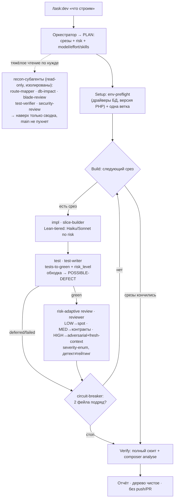

# Guideline: субагенты и workflow в azguard

Как azguard использует субагентов и Workflow-оркестрацию. Операционализирует
скилл `php:laravel-subagents` + уроки overnight-прогона под канон проекта.
Контекст и референсы — скилл `php:laravel-subagents`.

> [!info] Артефакты в репозитории
> - Агенты (build): `.claude/agents/azguard-{slice-builder,test-writer,reviewer}.md` (+ опц. `spec-writer`)
> - Агенты (recon, read-only): `.claude/agents/azguard-{route-mapper,db-impact,blade-review,test-verifier,security-review}.md`
> - Workflow: `.claude/workflows/azguard-dev-loop.js`
> - Review-gate хук: `.claude/hooks/review-gate.sh` + `.claude/review-gate.env.ini`

## Как ставятся задачи

Два входа. **Через плагин `tasks`** (интент-команды — пинят модель+effort под задачу, чтобы не
переключать вручную):

| Команда | Профиль | Модель/effort (команды) |
|:--|:--|:--|
| `/task:dev` | адаптивный dev-loop (срез→impl→test→risk-review) | Opus/high (планирование); субагенты — по риску |
| `/task:design` | проектирование: research-fanout + план/ADR, кода нет | Opus/high |
| `/task:review` | read-only adversarial-ревью, severity-enum | Opus/xhigh |
| `/task:research` | многоисточниковый research (RAG) | Opus/high |
| `/task:fix` | мелкая правка: single-agent, без fan-out | Sonnet/medium |

**Или напрямую:** оркестратор строит машиночитаемый PLAN (срезы + `risk` + `skills`) и запускает
Workflow `azguard-dev-loop` с `args.slices` (см. ниже). Скоуп срезов решает человек.

### Процесс workflow (dev-loop)



Ключ: **модель/effort субагентов заданы по риску среза и перебивают сессию** (Sonnet impl / Opus+xhigh
на HIGH-review / Haiku тривиал); **fan-out — только на research-фазе** (`/task:design|research`), не на
coding. Тяжёлую разведку делегируй recon-субагентам — они читают в своём окне, наверх отдают сводку.

## Когда вообще звать субагентов

Ценность субагента — **изоляция контекста и свежий взгляд**, не параллелизм.
Порог (из `php:laravel-subagents`):

- **Да:** задача ≥3 доменов/слоёв; целая фича (миграции→модели→логика→роуты→тесты);
  широкое исследование десятков файлов; ревью рискованного (авторизация, деньги,
  миграции с данными).
- **Нет (важнее триггеров):** мелкая/средняя правка — один-два слоя, багфикс,
  поле, рефактор одного слоя — делай напрямую. Принудительная декомпозиция мелочи
  = налог: токены растут, контекст теряется, качество не выигрывает.

Архитектурный код (контракты, модели, ключевые Actions) пиши сам в основном
контексте — там сосредоточено знание ТЗ. Не пинь дешёвые модели на фундамент.

## Проектные агенты

Преднагружены архитектурными скиллами через нативное поле `skills:` (Claude Code
≥2.0.43, детерминированный preload). Тюнингованы под azguard: php,
тест-фреймворк pest, канон access-layer.

| Агент | Роль | Когда звать |
|:--|:--|:--|
| `azguard-slice-builder` | реализатор среза (route→Action/Repository→DTO→policy), коммитит в текущую ветку, тесты не пишет | на реализацию вертикального среза |
| `azguard-test-writer` | тесты (pest) по готовому коду, итерирует до зелёного через php | после реализации среза |
| `azguard-reviewer` | risk-адаптивное read-only ревью (LOW→spot / MED→контракты / HIGH→adversarial+fresh-context), severity-enum, детект≠гейтинг | после каждой зелёной единицы |
| `azguard-{route-mapper,db-impact,blade-review,test-verifier,security-review}` | **read-only recon** (карта роутов / БД-импакт / вьюхи / прогон тестов→сводка / security) в ИЗОЛИРОВАННОМ контексте — наверх только сводка | тяжёлая разведка перед правкой (main-контекст не пухнет); модель `haiku` (дешёвая) |

> Модели build-агентов — Lean-tiered по умолчанию (slice-builder/test-writer `sonnet`, reviewer/spec-writer
> `opus`), а per-slice ещё уточняются по `risk`. Фундамент (контракты/модели) пиши сам — не пинь дешёвые модели.

Плагин swissknifeman даёт ещё `Explore` (read-only исследование), `Plan`
(архитектурный план), `system:code-coordinator` (межпроектный анализ),
`php:laravel-reviewer`/`php:laravel-test-writer` (общие, Pest-ориентированные —
для azguard предпочитай проектные `azguard-*`).

## Workflow `azguard-dev-loop`

Исполняет список срезов последовательно на одной ветке: по срезу
**impl → tests-to-green → review-gate**, circuit-breaker, финальный verify.

**Скоуп решает человек** и передаёт через `args` (workflow исполняет, а не
придумывает продуктовый объём):

```js
args = {
  branch: 'feat/<имя-прогона>',   // одна ветка на весь прогон
  base: 'main',                    // база для diff/review
  max_slices: 3,                   // хард-кап (переживает resume)
  slices: [
    { id: 'catalog-read-api', title: '...', domain: 'Catalog',
      goal: '...', acceptance_criteria: '...', skills: ['php:...'] },
  ],
}
```

Запуск: оркестратор зовёт Workflow с `{ name: 'azguard-dev-loop' }` и этим `args`,
или скилл `/azguard-dev-loop`. Перед запуском обычно: инлайн собрать список срезов
(можно отдельным проходом по docs), показать пользователю, и только потом гнать.

## Уроки overnight-прогона (зашиты в workflow — соблюдай и вручную)

1. **Один branch на прогон, НЕ ветка-на-срез.** Агенты-реализаторы не делают
   `checkout base` перед новой веткой → срезы складываются стопкой, поздний уходит
   от древнего коммита. Все срезы — последовательно на ОДНОЙ ветке (или
   worktree-изоляция с явной базой). Агенты ветки не создают/не переключают.
2. **Хард-кап числа срезов держи литералом в скрипте.** `args` на resume может не
   долететь → `slice(0, undefined)` = без лимита. В `azguard-dev-loop` дефолт
   `DEFAULT_MAX` зашит константой.
3. **Синтез бэклога — два шага.** Один агент с тяжёлой вложенной schema залипает в
   retry-петле. Решение: free-text синтез (без schema) → крошечный `effort:low`
   пасс структуризации.
4. **Фиддли-setup делай инлайн сам** (Filament install, разовая обвязка). Workflow —
   на повторяемую часть (срезы по доменам).
5. **Circuit-breaker.** 2 не-зелёных среза подряд → стоп, в отчёт. Не закапывайся.
6. **Параллель — только для независимого по файлам.** Срезы на одной ветке делят
   рабочее дерево → строй последовательно. Пересечение по файлам без worktree =
   конфликт.

## Review-gate (SubagentStop)

`.claude/hooks/review-gate.sh` гоняет лёгкую проверку на завершении субагента.
Режим в `.claude/review-gate.env.ini`: `off | warn | strict` (по умолчанию
**warn** — advisory, не блокирует). Дефолтная проверка — `composer analyse` (статика
проекта). `strict` блокирует завершение (exit 2) до починки.
Это deterministic-страховка поверх агента-ревьюера, не замена ему.

## Жёсткие гейты azguard (для агентов и workflow)

- Тесты/PHP — только `php` (composer test), не bare `php`.
- Если `.env` залочен хуком — не читать/не править; тестовая БД `:memory:`.
- Тест-фреймворк проекта — pest. Схему/миграции меняй по необходимости среза. Статика (если есть) — composer analyse.
- Канон access-layer: тонкий контроллер → Action (запись) / Repository (чтение) →
  DTO/Resource; мутации под `DB::transaction()`; авторизация через policy/gate.
- НЕ push, НЕ PR-merge, НЕ release. Каждый прогон — на своей ветке.

## Чеклист

- [ ] Порог субагентов проверен (крупная задача), иначе делал напрямую.
- [ ] Исследование — Explore-агентам; архитектурный код — сам.
- [ ] Прогон на ОДНОЙ ветке; хард-кап задан и переживает resume.
- [ ] Каждая единица прошла `azguard-reviewer`; тесты зелёные через php.
- [ ] Параллель только по независимым файлам (иначе worktree/последовательно).
- [ ] Находки ревью исправлены точечно, без перегенерации с нуля.
